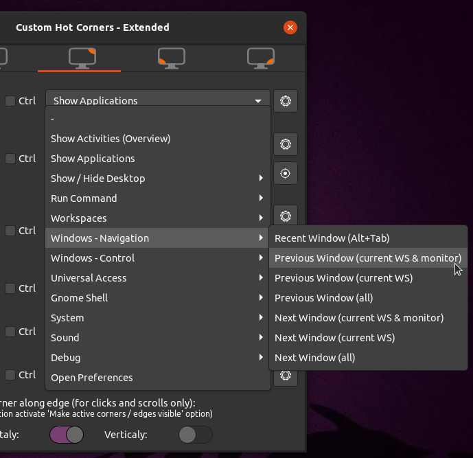

# Custom Hot Corners - Extended version

A GNOME Shell Extension for customizable hot corners and edges.

Features:

- Hot corners with adjustable barrier size (usable as hot edges)
- Mouse buttons and wheel can be used as triggers in addition to hot corners. Each direcion of a mouse wheel rotation is configurable separately.
- Each trigger can activate one of many actions including command execution, workspace and window navigation,  power manager actions, sound volume control, window colors inversion and more
- Preferences window provides app chooser dialog for Run Command action configuration - easy use as an application launcher
- Each corner's area reactive to mouse clicks and scrolls can be extended both horizontaly and/or verticaly to cover most lenght of the monitor's edges. If an adjacent corner is not set to expand in related direction, the corner can be expanded to 7/8 of the monitor's width/height. If two adjacents corners are set to expand to each other's direction, than it is 1/2 for each. You can see the result of expansion settings by activation of the *Make active corners/edges visible* option.
- Fallback hot corner triggers as manual option - useful on virtualized systems where pressure barriers are supported by the system but ignored by the pointer.
- Various options for window and workspace switchers

## Installation

Install the extension from the git repository with the following steps (which
require the GNU Build System):

    autoreconf -i
    ./configure
    make local-install
